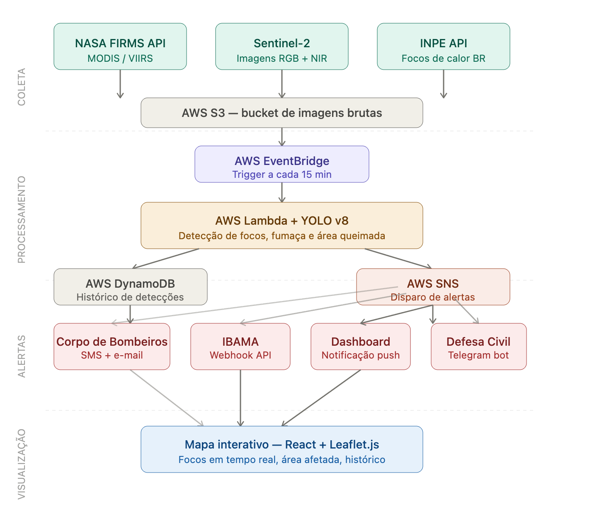

# FIAP — Faculdade de Informática e Administração Paulista

<p align="center">
  <a href="https://www.fiap.com.br/">
    
  </a>
</p>

<br>

# 🔥 FireWatch — Sistema Inteligente de Detecção de Incêndios Florestais

> Plataforma serverless de monitoramento de incêndios em tempo real para o Brasil, integrando dados satelitais da NASA e INPE com visão computacional (YOLO v8) sobre infraestrutura AWS totalmente serverless.

---

## 📌 O Problema

O Brasil perde em média **2 a 4 horas** entre a ignição de um foco de incêndio e a notificação das autoridades. Nesse intervalo, um hectare pode virar dez. O FireWatch foi construído para fechar essa janela: processamento automático a cada 15 minutos, alertas diretos para Corpo de Bombeiros, IBAMA e Defesa Civil.

---

## 🏗️ Arquitetura — Pipeline Híbrido

O sistema usa **duas pipelines paralelas** que convergem no DynamoDB:

```
┌─────────────────────────────────────────────────────────────────┐
│  PIPELINE 1 — Hotspots Satelitais (NASA FIRMS)                  │
│                                                                 │
│  EventBridge (15 min)                                           │
│    → collectors/nasa_firms.py  →  S3 raw/nasa_firms/*.csv       │
│    → Lambda processor                                           │
│        → lê CSV  →  classifica por FRP (Fire Radiative Power)   │
│        → DynamoDB  →  SNS alert (se FRP ≥ 50 MW)               │
└─────────────────────────────────────────────────────────────────┘

┌─────────────────────────────────────────────────────────────────┐
│  PIPELINE 2 — Imagens → YOLO v8                                 │
│                                                                 │
│  collectors/fetch_modis_tiles.py  →  S3 raw/modis/*.jpg         │
│    → Lambda processor                                           │
│        → download imagem do S3                                  │
│        → YOLO v8n inference (confiança > 0.75)                  │
│        → DynamoDB  →  SNS alert                                 │
└─────────────────────────────────────────────────────────────────┘

                    ↓ (ambas pipelines)
              AWS DynamoDB
                    ↓
         API Gateway  →  Dashboard React + Leaflet.js
```

> **Idempotência:** como o EventBridge re-executa o processor a cada 15 min e ele relista os CSVs em `raw/`, cada hotspot FIRMS recebe um `detection_id` determinístico (`uuid5` de `fonte+lat+lon+FRP+data de aquisição`) gravado com *conditional put*. Reprocessar o mesmo foco é um no-op — sem duplicação no DynamoDB e sem reenvio de alerta SNS.

### Por que pipeline híbrida?

Durante o desenvolvimento, tentamos treinar o YOLO diretamente em imagens MODIS para detecção satelital — o mAP resultante foi 0.003 (inviável). A razão é física: imagens MODIS RGB têm resolução de 250m/pixel; um foco de incêndio ocupa 1-2 pixels e não tem textura visual detectável. Detecção satelital real requer bandas SWIR/NIR (infravermelho), não disponíveis no dataset MODIS RGB.

A solução híbrida é a mesma abordagem usada por sistemas reais: **FIRMS como ground-truth satelital** (já validado pela NASA) + **YOLO para câmeras/drones com imagens RGB**.

---

## 🛰️ Fontes de Dados

| Fonte | Status | O que oferece | Cobertura | Como acessar |
|-------|--------|---------------|-----------|--------------|
| **NASA FIRMS** | ✅ Ativo | Focos de calor VIIRS + MODIS | Global / Tempo real | [firms.modaps.eosdis.nasa.gov](https://firms.modaps.eosdis.nasa.gov/api/area/) |
| **NASA GIBS / MODIS Terra** | ✅ Ativo | Tiles de imagem true-color | Global | WMTS público |
| **IBAMA SISFOGO** | ⚠️ Parcial | Ocorrências por estado (sem lat/lon) | Brasil | CSV público aberto |
| **INPE BDQueimadas** | ❌ Offline | Focos históricos Brasil | Brasil | API em manutenção desde jun/2026 |
| **Sentinel-2 (Copernicus)** | ⚙️ Integrado | Imagens RGB+NIR multiespectrais | Global | [dataspace.copernicus.eu](https://dataspace.copernicus.eu/) |

> **Nota sobre INPE:** A API `queimadas.dgi.inpe.br/api/` retorna 404 desde junho/2026 (migração de endpoint). O `collectors/inpe.py` foi reescrito para usar a **NASA FIRMS área API** como fonte — o INPE usa os mesmos dados satelitais FIRMS internamente, então a atribuição permanece válida como "NASA FIRMS / INPE".

---

## 🧠 Modelo de Visão Computacional — YOLO v8n

### Classes detectadas

| Classe | Ícone no mapa | Descrição | Exemplos de fonte |
|--------|---------------|-----------|-------------------|
| `foco_ativo` | 🔴 Círculo com anel pulsante (ALTA) | Chamas visíveis / calor intenso | Câmeras, drones, imagens IR |
| `fumaca` | 🌫️ Nuvem cinza/azul | Pluma de fumaça em dispersão | Câmeras de longo alcance |
| `area_queimada` | 🟫 Quadrado marrom | Solo enegrecido pós-queima | Imagens de satélite |

### Processo de treinamento

O modelo foi treinado do zero — não havia nenhum modelo no projeto original:

1. **Dataset:** [`Simuletic/CCTV-Smoke-Fire-Emergency-Detection-Dataset`](https://huggingface.co/datasets/Simuletic/CCTV-Smoke-Fire-Emergency-Detection-Dataset) — 239 imagens anotadas (HuggingFace)
2. **Preparação:** `training/prepare_dataset.py` — organiza em splits YOLO (70/20/10), remapeia classes
3. **Treinamento:** 50 épocas, YOLOv8n, imgsz=640, batch=16 — hardware Apple M2 MPS
4. **Resultado:** mAP50 = **0.902** (focos e fumaça)
5. **Deploy:** modelo `.pt` enviado ao S3 (`models/firewatch_yolov8.pt`), Lambda baixa no cold start

### Tentativa de fine-tuning satelital

Após o treinamento base, tentamos um fine-tuning em imagens MODIS reais:

- **Script:** `training/build_satellite_dataset.py` — 119 tiles MODIS com 815 bounding boxes pseudo-label
- **Resultado:** mAP = 0.003 — inviável
- **Motivo:** YOLO detecta padrões visuais (textura, cor, forma). Em 250m/pixel, um foco é 1-2 pixels sem padrão reconhecível. Detecção satelital real exige bandas SWIR/NIR, não RGB.
- **Decisão:** manter modelo original (mAP=0.902) + pipeline FIRMS para dados satelitais

---

## 🖥️ Dashboard — Funcionalidades

O dashboard React exibe dados em tempo real com interatividade completa:

### Navegação mapa ↔ lista
- **Clique num item da lista** → mapa voa automaticamente (`flyTo`) para o foco com zoom 10 e abre o popup
- **Clique num marcador no mapa** → seleciona o item correspondente na lista lateral (borda laranja)

### Filtros por satélite (Header)
Os badges de satélite são botões de filtro com toggle:

| Badge | Filtra por |
|-------|-----------|
| 🛰 NASA FIRMS | Hotspots CSV do FIRMS |
| 🌍 MODIS Terra | Tiles de imagem MODIS |
| 📡 Sentinel-2 | Imagens Copernicus |
| 🇧🇷 IBAMA/SISFOGO | Dados IBAMA |

### Filtros inline no painel
- **Por classe:** Todos | 🔥 Foco | 💨 Fumaça | 🟫 Queimada
- **Por severidade:** Todas | ALTA | MEDIA | BAIXA
- Todos os filtros são combinados e se aplicam simultaneamente ao mapa e à lista

### Diferenciação visual no mapa
- `foco_ativo` ALTA → círculo vermelho com **anel pulsante animado** (CSS `@keyframes`)
- `foco_ativo` MEDIA/BAIXA → círculo sólido laranja/amarelo
- `fumaca` → **ícone de nuvem** cinza/azul distinto (SVG com elipses)
- `area_queimada` → quadrado marrom com X hachurado

### Informações de alerta
- Cada detecção mostra se alerta SNS foi enviado (`✓ Alertado`)
- Aba Alertas exibe: horário de detecção + "mesmo ciclo (≤ 15 min)"
- FRP (Fire Radiative Power em MW) exibido para hotspots FIRMS

### Storytelling dinâmico
- Header e painel lateral exibem narrativa contextual baseada nos dados ao vivo
- Exemplo: *"126 focos ativos detectados em 8 estados nas últimas 72h. Estado mais afetado: MT. Último ciclo às 14:32."*

---

## 🗂️ Estrutura do Projeto

```
FireWatch/
│
├── assets/
│   └── architecture.png              # Diagrama da arquitetura AWS
│
├── infrastructure/                   # Terraform — IaC para AWS
│   ├── main.tf                       # Provider AWS (sa-east-1) e backend
│   ├── variables.tf                  # Variáveis (região, nome, ambiente)
│   ├── outputs.tf                    # Outputs: ARNs, URLs, bucket name
│   ├── s3.tf                         # Bucket S3 para imagens brutas
│   ├── dynamodb.tf                   # Tabela detecções + GSI state-timestamp
│   ├── lambda.tf                     # 2 Lambdas Docker: processor + api
│   ├── ecr.tf                        # ECR repo para imagem Docker da Lambda
│   ├── eventbridge.tf                # Trigger cron a cada 15 minutos
│   ├── sns.tf                        # Tópico SNS para alertas
│   ├── api_gateway.tf                # REST API: /detections, /stats, /alerts + CORS
│   └── terraform.tfvars.example      # Template de variáveis (nunca commitar .tfvars)
│
├── lambda/
│   ├── Dockerfile                    # Amazon Linux 2, CPU-only PyTorch, mesa-libGL
│   ├── requirements.txt              # ultralytics 8.4.60, boto3, Pillow, opencv-headless
│   ├── build_and_push.sh             # build linux/amd64 --provenance=false → ECR → update Lambda
│   └── processor/
│       ├── handler.py                # Pipeline híbrida: FIRMS CSV + YOLO imagens
│       ├── api_handler.py            # Rotas: /detections /stats /alerts (CORS headers)
│       ├── detector.py               # YOLO v8 wrapper — baixa modelo S3 no cold start
│       ├── config.py                 # Env vars, thresholds, bbox Brasil
│       └── services/
│           ├── dynamodb_service.py   # save_detection() → (id, ts), scan, stats, alerts
│           ├── s3_service.py         # download/list imagens S3
│           └── sns_service.py        # publish_alert() com severidade e estado
│
├── collectors/
│   ├── config.py                     # Configurações compartilhadas
│   ├── nasa_firms.py                 # FIRMS API → hotspots VIIRS/MODIS → S3 CSV
│   ├── inpe.py                       # Fallback FIRMS área Brasil (API INPE offline)
│   ├── sentinel2.py                  # Sentinel-2 Copernicus → imagens RGB+NIR → S3
│   ├── fetch_modis_tiles.py          # NASA GIBS WMTS → tiles MODIS true-color → S3
│   ├── seed_demo_data.py             # Injeta 60 detecções demo no DynamoDB
│   └── run_collectors.sh             # Roda todos os collectors com .env ativado
│
├── notifications/
│   ├── telegram_bot.py               # Bot Telegram — alertas à Defesa Civil
│   └── webhook_sender.py             # Webhook HTTP — notificações ao IBAMA
│
├── training/
│   ├── train.py                      # Treino YOLO v8n (50 épocas, M2 MPS) → mAP=0.902
│   ├── data.yaml                     # Config dataset 3 classes: foco_ativo, fumaca, area_queimada
│   ├── data_satellite.yaml           # Config dataset satelital (fine-tuning — mAP=0.003, abandonado)
│   ├── prepare_dataset.py            # Organiza HuggingFace dataset em splits YOLO 70/20/10
│   ├── download_datasets.py          # Baixa datasets públicos (D-Fire, Roboflow)
│   ├── build_satellite_dataset.py    # Pseudo-label: FIRMS coords + MODIS tiles → 119 tiles, 815 labels
│   └── requirements.txt              # torch + ultralytics + MPS support
│
├── dashboard/
│   ├── index.html
│   ├── vite.config.js                # Proxy /api → API Gateway (resolve CORS em dev)
│   ├── package.json
│   ├── .env.example                  # Template: VITE_API_BASE_URL=https://...
│   └── src/
│       ├── App.jsx                   # Estado global: filtros, focusedDetection, polling 72h
│       ├── main.jsx
│       ├── services/
│       │   └── api.js                # Dev: /api (proxy). Prod: URL completa
│       └── components/
│           ├── Header/
│           │   └── Header.jsx        # Badges satélite = botões filtro + storytelling dinâmico
│           ├── Map/
│           │   ├── FireMap.jsx       # MapController (flyTo) + marcadores filtrados
│           │   └── FireMarker.jsx    # Ícones distintos por classe + pulse ALTA + auto-popup
│           └── AlertPanel/
│               └── AlertPanel.jsx   # Chips filtro, click→flyTo, FRP, timing alertas
│
├── .env.example                      # Template raiz — AWS, FIRMS, Sentinel, Telegram
├── .gitignore                        # Exclui: .env, datasets/, runs/, *.pt, node_modules/
└── Readme.md
```

---

## ⚙️ Setup e Deploy

### Pré-requisitos

- Python 3.11+ (recomendado: `conda create -n firewatch python=3.11`)
- Node.js 18+
- Terraform 1.5+
- Docker Desktop
- AWS CLI configurado (`aws configure`)
- Conta AWS com permissões: S3, Lambda, ECR, DynamoDB, SNS, EventBridge, API Gateway, IAM

### 1. Clone e configure variáveis

```bash
git clone git@github.com:GeanDeAraujo/GS2-FIREWATCH-TIAR-2026.git
cd GS2-FIREWATCH-TIAR-2026
cp .env.example .env
# Edite .env com suas credenciais (nunca commitar este arquivo)
```

### 2. Provisione a infraestrutura AWS com Terraform

```bash
cd infrastructure
cp terraform.tfvars.example terraform.tfvars
# Edite terraform.tfvars com seu projeto e ambiente

terraform init

# Bootstrap: as Lambdas usam package_type = "Image" e não podem ser criadas
# antes da imagem existir no ECR. Provisione primeiro só o repositório ECR:
terraform apply -target=aws_ecr_repository.lambda_processor
```

Em seguida faça o build/push da imagem (passo 4) e só então aplique o restante:

```bash
terraform apply   # cria Lambdas, API Gateway, DynamoDB, SNS, EventBridge…
```

Anote os outputs: `api_gateway_url`, `s3_bucket_name`, `dynamodb_table_name`, `sns_topic_arn`.

> **Ordem do primeiro deploy:** `terraform apply -target=aws_ecr_repository.lambda_processor` → `lambda/build_and_push.sh` (passo 4) → `terraform apply`. O `build_and_push.sh` detecta que as Lambdas ainda não existem, faz só o push e avisa para rodar o `terraform apply` final. Em deploys seguintes basta rodar `build_and_push.sh`, que atualiza o código das funções diretamente.

### 3. Treine o modelo YOLO (ou use o existente no S3)

```bash
cd training
pip install -r requirements.txt
python prepare_dataset.py      # baixa e organiza o dataset (~239 imagens)
python train.py                # 50 épocas (~30 min no M2 MPS)
aws s3 cp runs/train/firewatch_v1/weights/best.pt \
    s3://<SEU_BUCKET>/models/firewatch_yolov8.pt
```

> O modelo fica no S3. A Lambda baixa automaticamente no cold start via `detector.py`.

### 4. Build e deploy da Lambda

```bash
cd lambda
chmod +x build_and_push.sh
./build_and_push.sh   # build linux/amd64, push ECR, update Lambda
```

O script usa `--provenance=false` para garantir imagem single-arch (requisito Lambda).

### 5. Execute os collectors

```bash
bash collectors/run_collectors.sh

# Ou individualmente:
source .env
python collectors/nasa_firms.py
python collectors/fetch_modis_tiles.py
python collectors/inpe.py
```

### 6. Invoque a Lambda manualmente (opcional)

```bash
aws lambda invoke \
  --function-name firewatch-processor-prod \
  --region sa-east-1 \
  --payload '{"source":"manual"}' \
  --cli-binary-format raw-in-base64-out \
  /tmp/out.json && cat /tmp/out.json
```

### 7. Inicie o dashboard

```bash
cd dashboard
cp .env.example .env
# Edite .env: VITE_API_BASE_URL=https://<seu-api-id>.execute-api.sa-east-1.amazonaws.com/prod
npm install
npm run dev
# Acesse http://localhost:3000
```

> O Vite usa proxy `/api → API Gateway`, então não há erro de CORS em desenvolvimento.

---

## 🔌 Variáveis de Ambiente

Copie `.env.example` para `.env` e preencha:

| Variável | Descrição | Onde obter |
|----------|-----------|------------|
| `AWS_REGION` | Região AWS (ex: `sa-east-1`) | Console AWS |
| `AWS_ACCESS_KEY_ID` | Credencial AWS | IAM → Usuários → Security credentials |
| `AWS_SECRET_ACCESS_KEY` | Credencial AWS | IAM → Usuários → Security credentials |
| `AWS_BUCKET_NAME` | Nome do bucket S3 | Output do `terraform apply` |
| `DYNAMODB_TABLE_NAME` | Nome da tabela DynamoDB | Output do `terraform apply` |
| `SNS_TOPIC_ARN` | ARN do tópico SNS | Output do `terraform apply` |
| `NASA_FIRMS_API_KEY` | Chave API NASA FIRMS | [firms.modaps.eosdis.nasa.gov/api/area/](https://firms.modaps.eosdis.nasa.gov/api/area/) |
| `SENTINEL_CLIENT_ID` | ID do app Copernicus | [dataspace.copernicus.eu](https://dataspace.copernicus.eu/) → My Account |
| `SENTINEL_CLIENT_SECRET` | Segredo do app Copernicus | [dataspace.copernicus.eu](https://dataspace.copernicus.eu/) → My Account |
| `TELEGRAM_BOT_TOKEN` | Token do bot Telegram | [@BotFather](https://t.me/BotFather) → `/newbot` |
| `TELEGRAM_CHAT_ID` | ID do chat para alertas | `https://api.telegram.org/bot<TOKEN>/getUpdates` |
| `YOLO_CONFIDENCE_THRESHOLD` | Threshold de confiança (padrão: `0.75`) | — |
| `YOLO_MODEL_S3_KEY` | Caminho do modelo no S3 | Ex: `models/firewatch_yolov8.pt` |

---

## 🧪 Classificação de Severidade (Pipeline FIRMS)

Hotspots FIRMS são classificados por **FRP (Fire Radiative Power)** em megawatts:

| FRP | Classe | Severidade | Confiança |
|-----|--------|------------|-----------|
| ≥ 200 MW | `foco_ativo` | ALTA | ~0.92+ |
| 50–200 MW | `foco_ativo` | MEDIA | ~0.91 |
| < 50 MW | `fumaca` | BAIXA | 0.90 |

Fórmula: `min(0.99, 0.90 + frp / 10000)` — calibrada para FRP típico de incêndios no Cerrado e Amazônia.

---

## ❗ Decisões Técnicas e Limitações Conhecidas

| Decisão | Motivo |
|---------|--------|
| Pipeline FIRMS como ground-truth satelital | YOLO não funciona em MODIS RGB (250m/pixel, sem padrão visual detectável) |
| CPU-only PyTorch na Lambda | Lambda sem GPU; índice `/whl/cpu` reduz imagem de ~2.5 GB para ~933 MB |
| Docker ao invés de .zip | `ultralytics` + `torch` + `opencv` excedem 250 MB (limite .zip Lambda) |
| `yum` ao invés de `dnf` no Dockerfile | Base Amazon Linux 2 usa `yum`; `dnf` não existe |
| `--provenance=false` no build Docker | Docker buildx gera manifest multi-arch; Lambda exige single-arch |
| INPE API substituída por FIRMS área | `queimadas.dgi.inpe.br/api/` retorna 404 desde jun/2026 |
| `save_detection()` retorna `(id, timestamp, created)` | O flag `created` (do *conditional put*) diz ao chamador se o hotspot é novo, evitando reenvio de alerta SNS no reprocessamento |
| `ultralytics==8.4.60` (pin) | Versões > 8.2 com PyTorch 2.6 causavam `UnpicklingError` no cold start Lambda |
| Vite proxy `/api → API Gateway` | OPTIONS preflight retorna 403 da API ao vivo; proxy elimina cross-origin em dev |
| Estado calculado client-side no dashboard | `_lat_lon_to_state()` no Lambda retorna "BR" para coordenadas fora das regras simples |
| `detection_id` determinístico (`uuid5`) + *conditional put* idempotente | EventBridge relista os CSVs a cada 15 min; sem chave determinística os ~4484 hotspots seriam re-inseridos a cada ciclo, inflando estatísticas |
| Range key sentinela (epoch) p/ hotspots sem data parseável | Garante idempotência sem usar `now()` (que mudaria a cada execução); registros malformados não duplicam |
| TTL de 90 dias (`expires_at`) no DynamoDB | Expira detecções antigas automaticamente, contendo custo de armazenamento sem job de limpeza |
| `_scan_all()` com teto de páginas (`_MAX_SCAN_PAGES`) | `scan` aplica `Limit` antes do `FilterExpression`; paginação completa corrige a contagem, e o teto limita RCU/latência (timeout 30s da Lambda de API) |
| Trigger de redeploy do API Gateway por corpo dos recursos | Hashear os recursos inteiros (não só `.id`) re-deploya o stage em edições in-place de `uri`/`request_templates`/`authorization` |
| `Subject` do SNS em ASCII | SNS rejeita `Subject` não-ASCII (≤100 chars); em-dash trocado por hífen |
| Telegram `parse_mode=Markdown` (legado) | `MarkdownV2` exigiria escapar `. - ( ) %` no texto, retornando HTTP 400 |

---

## 📡 API Endpoints

Base URL: `VITE_API_BASE_URL` (dashboard) ou diretamente via curl

| Método | Endpoint | Descrição | Query Params |
|--------|----------|-----------|--------------|
| `GET` | `/detections` | Detecções recentes | `hours=72`, `limit=200`, `state=AM` |
| `GET` | `/stats` | Estatísticas agregadas 24h | — |
| `GET` | `/alerts` | Alertas SNS enviados | `limit=20` |

---

## 🔬 Validação End-to-End

```bash
# Stats ao vivo
curl "https://<api-id>.execute-api.sa-east-1.amazonaws.com/prod/stats"
# → {"total_focos": 126, "top_state": "MT", "states_affected": 8, ...}

# Últimas detecções
curl "https://<api-id>.execute-api.sa-east-1.amazonaws.com/prod/detections?hours=24&limit=5"

# Invocar Lambda manualmente
aws lambda invoke \
  --function-name firewatch-processor-prod \
  --region sa-east-1 \
  --payload '{"source":"manual"}' \
  --cli-binary-format raw-in-base64-out \
  /tmp/result.json && cat /tmp/result.json
# → {"statusCode": 200, "body": {"firms_hotspots_added": 4484, "images_processed": 15, "alerts_sent": 0}}
```

> `firms_hotspots_added` conta apenas hotspots **novos**. Em uma segunda invocação sobre os mesmos CSVs o valor é `0` (idempotência via `detection_id` determinístico) — comprovando que o reprocessamento de 15 min não duplica registros.

---

## 🚀 Tecnologias

| Camada | Tecnologia |
|--------|-----------|
| IA / Visão Computacional | Python 3.11, YOLO v8n (Ultralytics 8.4.60), PyTorch 2.6 CPU |
| Cloud | AWS Lambda (Docker), S3, DynamoDB, SNS, EventBridge, API Gateway, ECR |
| IaC | Terraform 1.5+ |
| Containerização | Docker (linux/amd64, Amazon Linux 2) |
| Frontend | React 18, Vite 5, Leaflet.js, react-leaflet |
| Dados Satelitais | NASA FIRMS (VIIRS/MODIS), NASA GIBS WMTS, Sentinel-2 (Copernicus) |

---

## 👥 Integrantes do Grupo

| Nome | RM | Turma |
|------|----|-------|
| Gean Junio Ferreira de Araujo | rm567167 | TIAR |
| Victor Copque dos Reis | rm566821 | TIAR |
| Victor Hugo Ferreira Rolim | rm568006 | TIAR |

## 👨‍🏫 Professores

- **Tutor: Ana Cristina dos Santos —
- **Coordenador:** — André Godoi Chiovato

---

## 📋 Licença


Projeto acadêmico desenvolvido para a **FIAP** sob licença [CC BY 4.0](http://creativecommons.org/licenses/by/4.0/).
